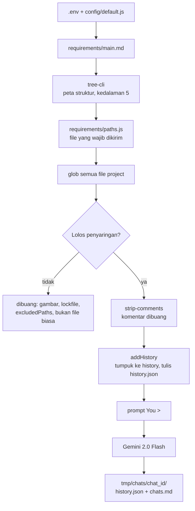
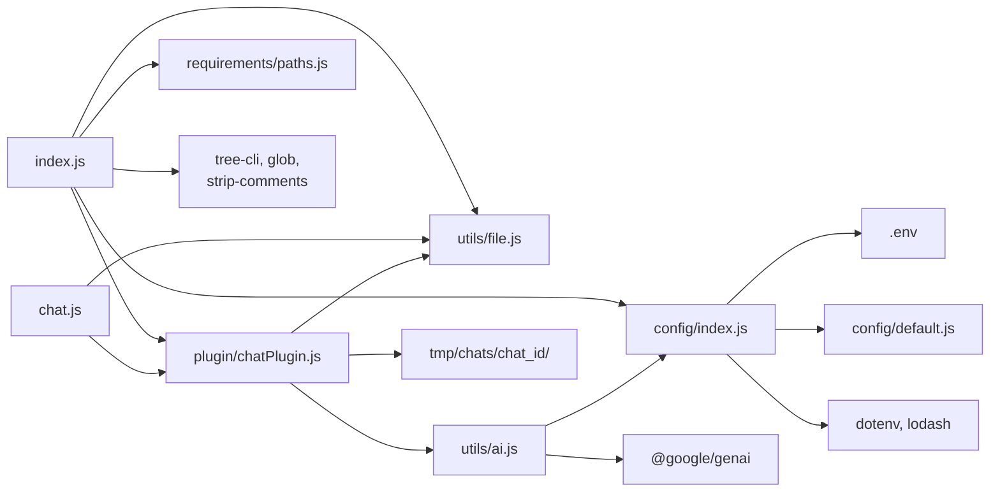
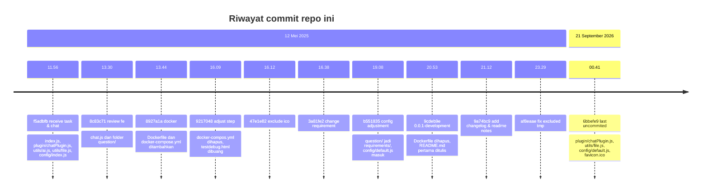

# Code Reviewer

CLI kecil untuk membacakan seluruh isi sebuah project ke Gemini, lalu mengajaknya berdiskusi di terminal. Dibuat untuk satu kebutuhan: cepat paham isi repo orang lain dan tahu kualitasnya, tanpa langganan IDE dan tanpa kartu kredit.

Status: `0.0.1-development`. Tool pribadi, belum ada test otomatis.

## Prasyarat

- Node.js >= 18
- API key Gemini, gratis di https://aistudio.google.com/apikey

## Instalasi

```bash
git clone <repository_url>
cd reviewer
npm install
cp .env.example .env     # lalu isi PROJECT_PATH dan GEMINI_API_KEY
```

## Pemakaian

### Muat konteks lalu buka sesi

```bash
npm run review
```

`index.js` menjalankan urutan ini:

1. mengirim `requirements/main.md` sebagai konteks tujuan project;
2. mengirim peta struktur project dari `tree-cli`, kedalaman 5;
3. mengirim file yang didaftarkan di `requirements/paths.js`;
4. mengirim isi semua file project yang lolos penyaringan;
5. membuka prompt `You >`.

Alur lengkapnya:



Langkah 1 sampai 4 tidak memanggil API. Semuanya hanya ditumpuk ke array `history` di memori, dan ditulis ke `tmp/chats/chat_<id>/history.json` setiap kali `addHistory()` dipanggil. Request pertama baru terjadi saat pertanyaan pertama dikirim.

### Perintah di dalam sesi

```text
You > bagian autentikasi ini aman?
You > lihat file src/middleware/auth.ts
You > quit
```

- ketik pertanyaan biasa untuk mengirimnya ke Gemini;
- `lihat file <path>` menambahkan isi file lain ke konteks, juga tanpa request API;
- `quit` atau Ctrl+C untuk keluar.

### Lanjutkan sesi lama

```bash
npm run chat 1747154698052
```

Id adalah nama folder di `tmp/chats/`. Kalau folder itu tidak ada, script berhenti dengan error, bukan membuat sesi kosong.

### Keluaran

```text
tmp/chats/chat_1747154698052/
├── history.json   # history percakapan, dipakai program untuk melanjutkan
└── chats.md       # transkrip untuk dibaca manusia
```

`tmp/` di-gitignore, jadi hasil sesi tidak ikut ter-commit.

## Cara konteks dikirim

`chatPlugin.addHistory(message, 'ya')` menambahkan pasangan user dan model ke array `history` tanpa memanggil API (`plugin/chatPlugin.js`). Isi project dimasukkan satu file per file, jadi batas antar-file tetap jelas untuk model. Bentuk array itu sudah sama dengan yang diminta `ai.chats.create({ history })`, jadi tidak ada konversi.

Setiap pertanyaan mengirim ulang seluruh history. Artinya biaya satu pertanyaan tumbuh seiring panjang percakapan, bukan seiring jumlah file, dan sesi yang panjang bisa menabrak context window.

## Konfigurasi

`.env`:

| Variabel | Wajib | Default |
| --- | --- | --- |
| `GEMINI_API_KEY` | ya | `YOUR_DEFAULT_API_KEY` dari `config/default.js` |
| `PROJECT_PATH` | tidak | `./tmp/project` |

`config/default.js`:

| Kunci | Nilai | Keterangan |
| --- | --- | --- |
| `aiModel` | `gemini-2.0-flash` | ganti model dengan mengedit file ini |
| `excludedPaths` | daftar string | `node_modules`, `.git`, `.github`, `.vscode`, `public/images`, `public/fonts`, `src/scss`, `src/fonts`, `src/vendor`, `.json`, `.ico`, `.svg`, `utils`, `src/Data`, `src/components`, `.bundle.js` |

`config/index.js` menggabungkan `.env` dengan nilai default lewat `dotenv` dan `lodash.merge`.

Folder `requirements/` dipakai untuk memberi konteks tambahan tanpa mengubah kode:

- `main.md`: tujuan dan konteks project, dikirim paling awal;
- `paths.js`: array `{ name, message, path }`. Setiap entri dikirim beserta pesan penjelasnya sebelum isi project diunggah.

## Penyaringan file

`index.js` membuang dari daftar kirim:

- file gambar: `.png`, `.jpg`, `.jpeg`, `.gif`, `.svg`, `.webp`, `.ico`;
- lockfile: `package-lock.json`, `yarn.lock`;
- path yang mengandung salah satu string di `excludedPaths`;
- path yang bukan file biasa;
- komentar di dalam file, dibuang dengan `strip-comments` sebelum teks dikirim.

## Struktur project

Dependensi antar modul:



Isi folder:

```text
reviewer/
├── index.js                 # entri utama: muat konteks, buka sesi
├── chat.js                  # entri alternatif: lanjutkan sesi lama
├── config/
│   ├── default.js           # aiModel, excludedPaths
│   └── index.js             # gabungan .env + default
├── plugin/
│   └── chatPlugin.js        # history, chats.md, resume
├── utils/
│   ├── ai.js                # chatting() dan streamChat() ke Gemini
│   └── file.js              # baca, tulis, cek file
├── requirements/
│   ├── main.md              # konteks tujuan project
│   └── paths.js             # file yang wajib dikirim lebih dulu
├── tmp/                     # di-gitignore
├── CHANGELOG.md             # riwayat perubahan
├── README_NOTES.md          # rencana prompt per kategori yang belum dikerjakan
├── README.md
├── LICENSE
├── .env.example
└── package.json             # script: review, chat
```

## Riwayat project

Repo ini generasi ketiga dari tool yang sama. Generasi sebelumnya tidak ada di repo ini, jadi diagram berikut hanya memakai `git log` branch `main` di sini: 11 commit, 10 di antaranya pada 12 Mei 2025 dan satu pada 21 September 2026.



Yang terbaca dari riwayat itu:

- hampir seluruh fitur ditulis dalam satu hari, 12 Mei 2025, dari 11.56 sampai 23.29;
- Docker sempat dicoba pukul 13.44 lalu dibuang pukul 20.53;
- folder `question/` berubah nama jadi `requirements/` pukul 19.08, bersamaan dengan masuknya `config/default.js`;
- versi `0.0.1-development` dan README pertama ditulis pukul 20.53;
- commit `6bbefe9` muncul 16 bulan setelahnya, 21 September 2026, berisi sisa pekerjaan yang tertinggal di working tree.

## Batasan dan masalah yang diketahui

- `excludedPaths` dicocokkan sebagai substring, bukan pola glob. String pendek seperti `.json` atau `utils` ikut membuang path yang tidak dimaksud, misalnya `package.json` dan `src/utils.ts`.
- Komentar dibuang sebelum dikirim, jadi informasi yang hanya ada di komentar hilang. Untuk repo yang dokumentasinya ditaruh di komentar, ini merugikan.
- Seluruh isi project dikirim sekaligus, jadi repo besar bisa lewat context window sebelum pertanyaan pertama.
- `history.json` menyimpan seluruh isi project, sehingga file sesi bisa besar dan tidak nyaman dibuka manual.
- `aiModel` hanya bisa diubah dengan mengedit `config/default.js`, belum lewat `.env`.
- `config/default.js` menyediakan fallback `YOUR_DEFAULT_API_KEY`, jadi lupa mengisi `.env` tidak langsung gagal dengan pesan yang jelas.
- Daftar ekstensi gambar dan nama lockfile masih hardcode di `index.js`, terpisah dari `excludedPaths`.
- `streamChat()` ada di `utils/ai.js` tetapi belum dipakai.
- Belum ada mode laporan: keluaran hanya transkrip percakapan, tanpa skor atau kesimpulan. Rencana laporan per dimensi masih tersimpan di `README_NOTES.md`.
- Belum ada test dan lint.

## Lisensi

MIT, lihat [LICENSE](./LICENSE). Dibuat oleh uzzzzy (akhmadfauzy@gmail.com).
